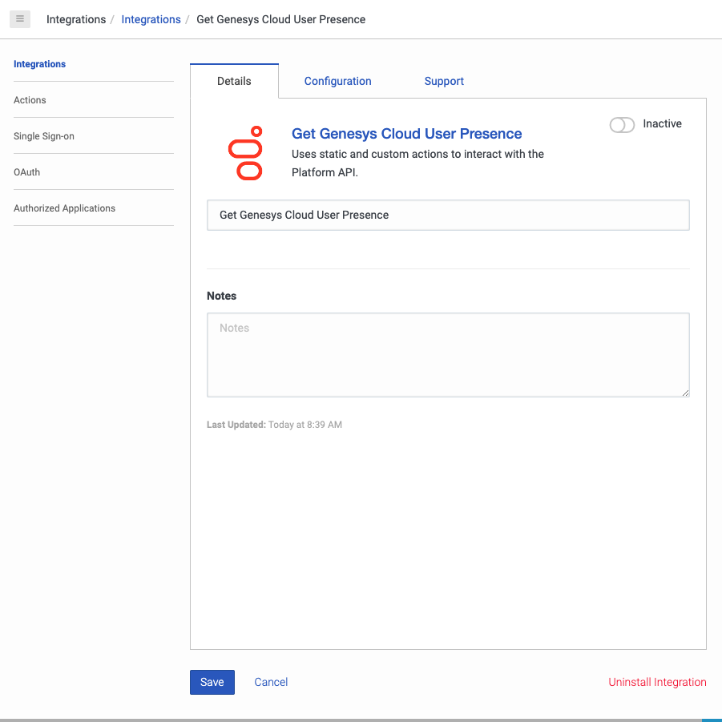
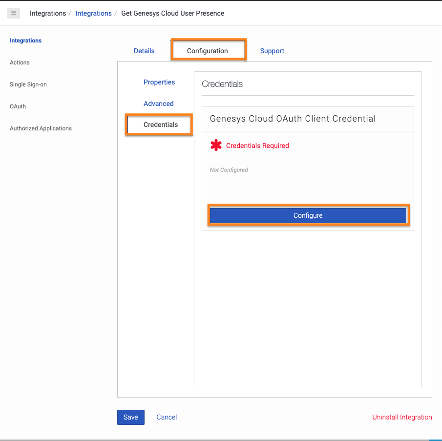
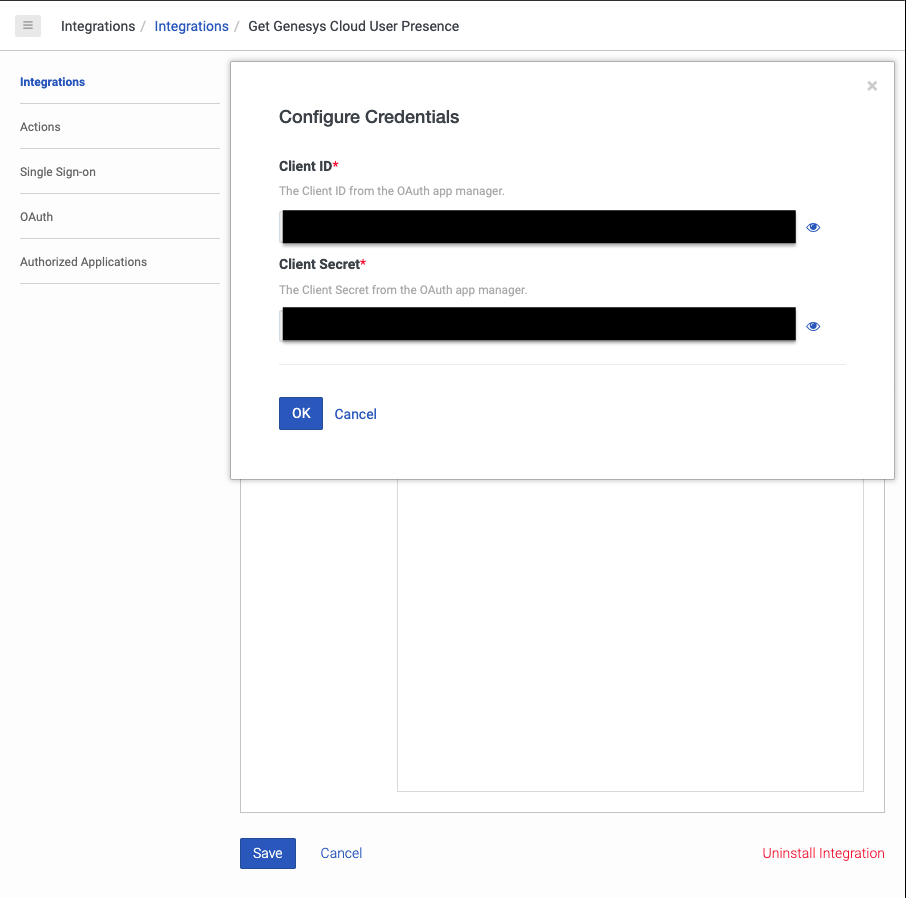
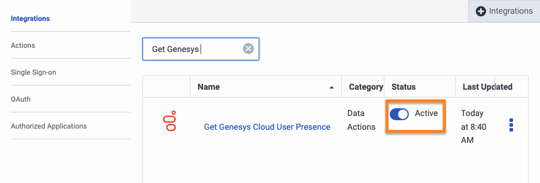
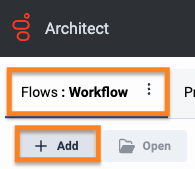
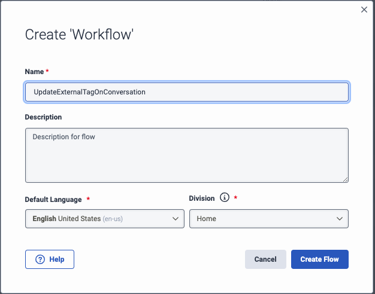
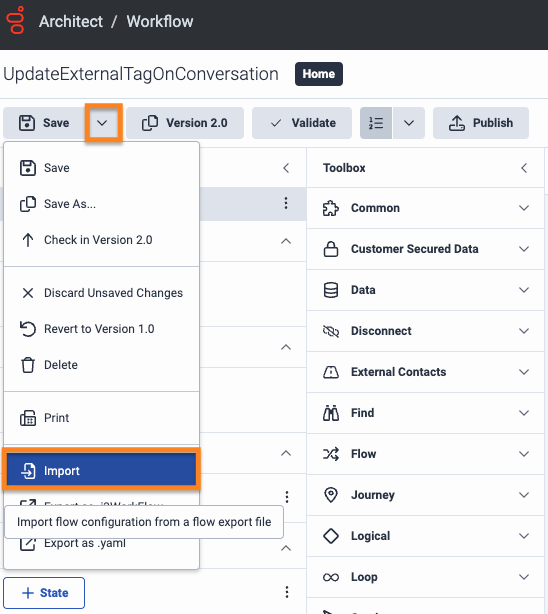
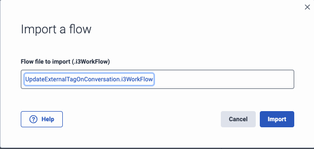
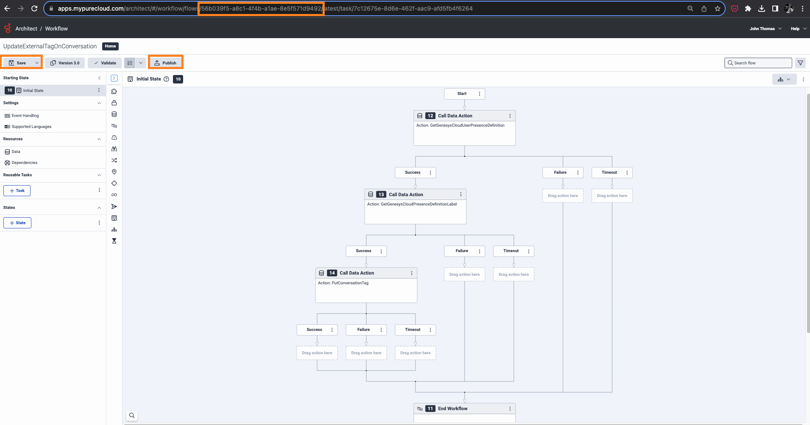

This Genesys Cloud Developer Blueprint explains how to set up Genesys Cloud to terminate an outbound voice call with no queue and place an external tag on the call for analytics and follow-up.

When an Architect workflow receives a Communicate call trigger, multiple Genesys Cloud Public API calls are made to update the conversation with an External Tag and then terminate the call.

The following illustration shows the end-to-end user experience that this solution enables.

## Solution components

* **Genesys Cloud** - A suite of Genesys cloud services for enterprise-grade communications, collaboration, and contact center management. Contact center agents use the Genesys Cloud user interface.
* **Genesys Cloud API** - A set of RESTful APIs that enables you to extend and customize your Genesys Cloud environment.

## Prerequisites

### Specialized knowledge

* Administrator-level knowledge of Genesys Cloud

### Genesys Cloud account

* A Genesys Cloud CX 1 license. For more information, see [Genesys Cloud Pricing](https://www.genesys.com/pricing "Opens the Genesys Cloud pricing article").
* The Master Admin role in Genesys Cloud. For more information, see [Roles and permissions overview](https://help.mypurecloud.com/?p=24360 "Opens the Roles and permissions overview article") in the Genesys Cloud Resource Center.

## Configure Genesys Cloud

### Create custom roles for use with Genesys Cloud OAuth clients

Create a custom role for use with a Genesys Cloud OAuth client with the following permissions:
:::primary
  **Note:** Custom role 2 is only required if you would still like GC users to make Communicate/PBX calls to other GC users.
  :::

| Roles           | Permissions | Role Name |
|-----------------|-------------------------|---------|
| Custom role 1 | **Conversation** > **Communication** > **Disconnect**, **Conversation** > **ExternalTag** > **Edit**  | Terminate Conversation Public API |
| Custom role 2 | **Analytics** > **Conversation Detail** > **View** | Get Conversation Details Public API |

To create a custom role in Genesys Cloud:

1. Navigate to **Admin** > **Roles/Permissions** and click **Add Role**.

   

2. Enter the **Name** for your custom role.

    

3. Search and select the required permission for each of the custom role.
   
4. Click **Save** to assign the appropriate permission to your custom role.

:::primary
  **Note:** Assign this custom role to your user before creating the Genesys Cloud OAuth client.
  :::

### Create an OAuth client for use with a Genesys Cloud data action integration

To enable a Genesys Cloud data action to make public API requests on behalf of your Genesys Cloud organization, use an OAuth client to configure authentication with Genesys Cloud.

Create an OAuth client for use with the data action integration with the following custom roles:
:::primary
  **Note:** OAuth Client 2 is only required if you would still like GC users to make Communicate/PBX calls to other GC users.
  :::

| OAuth Client   | Custom role | OAuth Client Name |
|----------------|-------------------------------|-------|
| OAuth Client 1 | Terminate Conversation Public API | Terminate Conversation Public API |
| OAuth Client 2 | Get Conversation Details Public API | Get Conversation Details Public API |

To create an OAuth Client in Genesys Cloud:

1. Navigate to **Admin** > **Integrations** > **OAuth** and click **Add Client**.

   

2. Enter the name for the OAuth client and select **Client Credentials** as the grant type. Click the **Roles** tab and assign the required role for the OAuth client.

     

3. Click **Save**. Copy the client ID and the client secret values for later use.

   

:::primary
  **Note:** Ensure that you copy the client ID and client secret values for each of the OAuth clients.
  :::

### Add Genesys Cloud data action integration

Add a Genesys cloud data action integration for each OAuth client being used with this blueprint to call the Genesys Cloud public API to:
* Terminate an outbound conversation that does not have a Queue ID
* Add an External Tag to conversations terminated due to missing Queue ID
* Optional: Check to see if the outbound call is to another GC user

:::primary
  **Note:** The optional 3rd bullet requires a second data action integration be created associated to OAuth Client 2 mentioned earlier in this blueprint.
  :::

To create a data action integration in Genesys Cloud:

1. Navigate to **Admin** > **Integrations** > **Integrations** and install the **Genesys Cloud Data Actions** integration. For more information, see [About the data actions integrations](https://help.mypurecloud.com/?p=209478 "Opens the About the data actions integrations article") in the Genesys Cloud Resource Center.

   

2. Enter a name for the Genesys Cloud data action, such as Update Genesys Cloud User Presence in this blueprint solution.

   

3. On the **Configuration** tab, click **Credentials** and then click **Configure**.

   

4. Enter the client ID and client secret that you saved for the Presence Public API [(OAuth Client 1)](#create-oauth-clients-for-use-with-genesys-cloud-data-action-integrations "Goes to the create an OAuth Client section"). Click **OK** and save the data action.

   

5. Navigate to the Integrations page and set the presence data action integration to **Active**.

   

### Import the Genesys Cloud data actions

Import the following JSON files from the [terminate-voice-calls-with-no-queue repo](https://github.com/GenesysCloudBlueprints/terminate-voice-calls-with-no-queue) GitHub repository:
* `Disconnect-Voice-Call.custom.json`
* `Put-Conversation-Tag.custom.json`
* Optional: `Check-Conversation-For-PSTN-Leg.custom.json`

:::primary
  **Note:** The optional 3rd bullet requires a third data action be imported.  This data action checks to see if the conversation has an external call leg to the PSTN.  Repeat Steps 1-3 below if you'd like to import this optional data action.
  :::

Import the `Disconnect-Voice-Call.custom.json` and `Put-Conversation-Tag.custom.json` files and associate with the Terminate Outbound Conversations With No Queue ID data action integration, which uses the Terminate Conversation Public API OAuth client.

1. From the [terminate-voice-calls-with-no-queue repo](https://github.com/GenesysCloudBlueprints/terminate-voice-calls-with-no-queue) GitHub repository, download the `Disconnect-Voice-Call.custom.json` file.

2. In Genesys Cloud, navigate to **Integrations** > **Actions** and click **Import**.

   

3. Select the `Disconnect-Voice-Call.custom.json` file and associate with the [Terminate Outbound Conversations With No Queue ID](#add-genesys-cloud-data-action-integrations "Goes to the Add Genesys Cloud data action integrations section") integration, and then click **Import Action**.

   

4. From the [terminate-voice-calls-with-no-queue repo](https://github.com/GenesysCloudBlueprints/terminate-voice-calls-with-no-queue) GitHub repository, download the `Put-Conversation-Tag.custom.json` file.

5. In Genesys Cloud, navigate to **Integrations** > **Actions** and click **Import**.

   

6. Select the `Put-Conversation-Tag.custom.json`file and associate it with the [Terminate Outbound Conversations With No Queue ID](#add-genesys-cloud-data-action-integrations "Goes to the Add Genesys Cloud data action integrations section") integration, and then click **Import Action**.

   

### Import the Architect workflows

This solution includes one Architect workflow that uses the two [data actions](#add-genesys-cloud-data-action-integrations "Goes to the Add a web services data actions integration section"). This workflow terminates an outbound phone call if it does have have a Queue ID and updates the External Tag on the conversation record to "No Queue".

* The **Terminate Outbound Call Missing Queue.i3WorkFlow** workflow is triggered when a Genesys Cloud user makes a Communicate call. This workflow terminates an outbound phone call if it does have have a Queue ID and updates the External Tag on the conversation record to "No Queue".

The Event Orchestration trigger invokes these workflows. The workflows in turn calls the Disconnect Voice Call and Put Conversation Tag data actions to update the outbound phone call.

First import this workflow to your Genesys Cloud organization:

1. Download the `Terminate Outbound Call Missing Queue.i3WorkFlow` file from the [terminate-voice-calls-with-no-queue repo](https://github.com/GenesysCloudBlueprints/terminate-voice-calls-with-no-queue) GitHub repository.

:::primary
  **Note:** If you would like to still allow Communicate/PBX calls between GC Users, use the `Terminate Outbound Call Missing Queue with PSTN Call Leg Check.i3WorkFlow` file.
  :::

2. In Genesys Cloud, navigate to **Admin** > **Architect** > **Flows:Workflow** and click **Add**.

   

3. Enter a name for the workflow and click **Create Flow**.

   

4. From the **Save** menu, click **Import**.

   

5. Select the downloaded **Terminate Outbound Call Missing Queue.i3WorkFlow** file and click **Import**.

   

6. Review your workflow. Click **Save** and then click **Publish**.

:::primary Note: If you would like to change the External Tag, replace **No Queue** in the **externalTagName** field with the string of your choice. :::

:::primary Note: If you imported the `Terminate Outbound Call Missing Queue with PSTN Call Leg Check.i3WorkFlow` file, your workflow will look like this. :::

## Create the event orchestration triggers

Create the trigger that invokes the created Architect workflow.

1. From Admin Home, search for **Triggers** and navigate to the Triggers list.

   

2. From the Triggers list, click **Add Trigger**

   

3. From the Add New Trigger modal, name your trigger and click **Add**

   

4. From the Trigger single view, in the **Topic Name** menu, select **v2.detail.events.conversation.{id}.user.start**.  In the **Workflow Target** menu, select **Terminate Outbound Call Missing Queue**.  Leave **Data Format** as **TopLevelPrimitives**.  Click **Add Condition**.

  

5. From the Trigger single view, in the **JSON Path** field, type **queueId**.  In the **Operator** menu, select **Exists**.  Set the **Value** toggle to **False**.  Click **Create**.

      

6. From the Trigger single view, set the **Active** toggle to **Active**.  Click **Save**.

     

## Additional resources

* [Genesys Cloud API Explorer](https://developer.genesys.cloud/devapps/api-explorer "Opens the GC API Explorer") in the Genesys Cloud Developer Center
* [Genesys Cloud notification triggers](https://developer.genesys.cloud/notificationsalerts/notifications/available-topics "Opens the Available topics page") in the Genesys Cloud Developer Center
* The [terminate-voice-calls-with-no-queue repo](https://github.com/GenesysCloudBlueprints/terminate-voice-calls-with-no-queue) repository in GitHub
