This Genesys Cloud Developer Blueprint explains how to set up Genesys Cloud to update the external tag on a conversation with a GC User's presence upon receiving an incoming Communicate (PBX/Non-ACD) call.

When an Architect workflow receives a communicate call trigger, multiple Genesys Cloud Public API calls are made to retrieve the receiving GC user's current presence and update the external tag on the triggering conversation with the presence of the Genesys Cloud user.

The following shows the end-to-end user experience that this solution enables.

## Solution components

* **Genesys Cloud** - A suite of Genesys cloud services for enterprise-grade communications, collaboration, and contact center management. Contact center agents use the Genesys Cloud user interface.
* **Genesys Cloud API** - A set of RESTful APIs that enables you to extend and customize your Genesys Cloud environment.
* **Postman** - A platform for creating and sharing APIs.

## Prerequisites

### Specialized knowledge

* Administrator-level knowledge of Genesys Cloud
* Experience with REST API authentication
* Experience with Postman

### Genesys Cloud account

* A Genesys Cloud 1 license. For more information, see [Genesys Cloud Pricing](https://www.genesys.com/pricing "Opens the pricing article").
* The Master Admin role in Genesys Cloud. For more information, see [Roles and permissions overview](https://help.mypurecloud.com/?p=24360 "Opens the Roles and permissions overview article") in the Genesys Cloud Resource Center.

## Configure Genesys Cloud

### Create three custom roles for use with Genesys Cloud OAuth clients

1. Navigate to **Admin** > **Roles/Permissions** and click **Add Role**.

   

2. Type a **Name** for your custom role.

  

3. Search and select the **processautomation**>**trigger**>**All Permissions** permissions and click **Save** to assign the appropriate permissions to your custom role.

:::primary
**Note:** Assign this role to your user record before creating the Genesys Cloud OAuth client, as described in the next section.  The **processautomation**>**trigger**>**All Permissions** permissions require event orchestration to be activated in your Genesys Cloud organization.
:::

4. Navigate to **Admin** > **Roles/Permissions** and click **Add Role**.

   

5. Type a **Name** for your custom role.

  

6. Search and select the **presence**>**All Permissions** permissions and click **Save** to assign the appropriate permissions to your custom role.

:::primary
**Note:** Assign this role to your user record before creating the Genesys Cloud OAuth client, as described in the next section.
:::

7. Navigate to **Admin** > **Roles/Permissions** and click **Add Role**.

   

8. Type a **Name** for your custom role.

  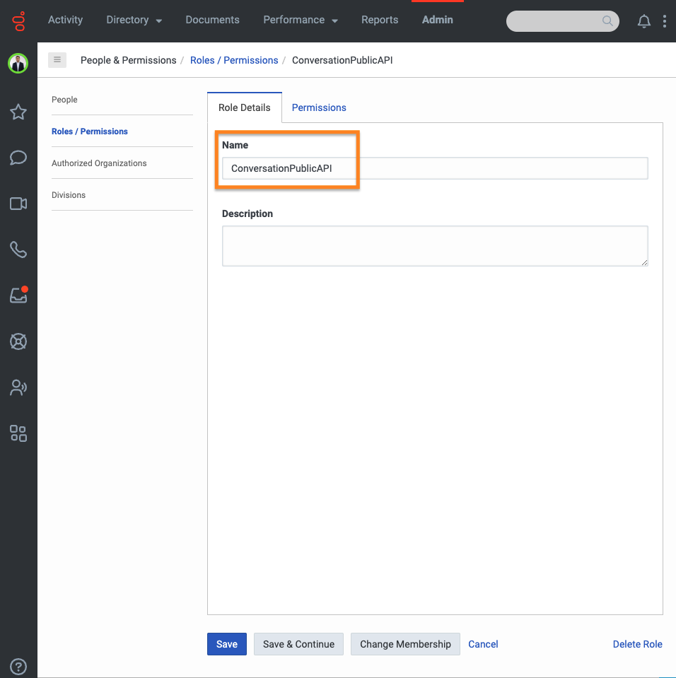

9. Search and select the **Analytics**>**Conversation Detail**>**View** and **Conversation**>**External Tag**>**Edit** permissions and click **Save** to assign the appropriate permissions to your custom role.

:::primary
**Note:** Assign this role to your user record before creating the Genesys Cloud OAuth client, as described in the next section.
:::

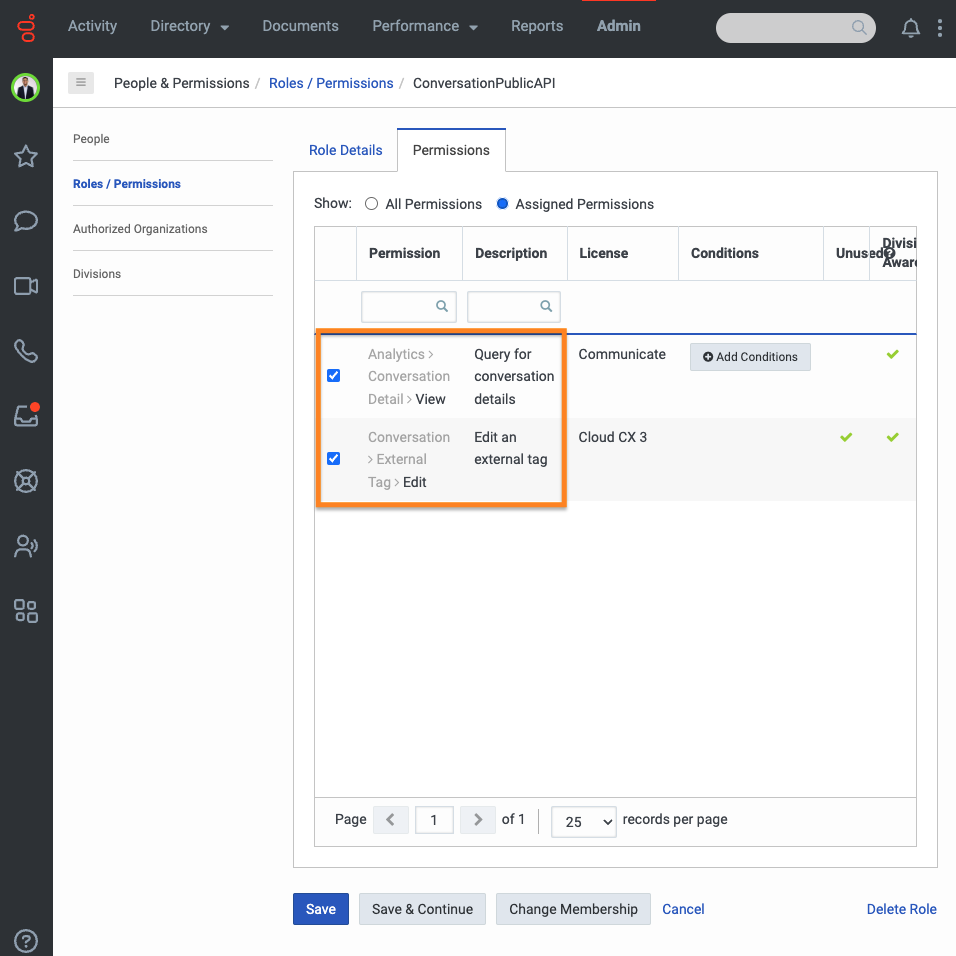

### Create two OAuth clients for use with Genesys Cloud data action integrations

To enable a Genesys Cloud data action to make public API requests on behalf of your Genesys Cloud organization, use an OAuth client to configure authentication with Genesys Cloud.

1. Navigate to **Admin** > **Integrations** > **OAuth** and click **Add Client**.

   

2. Enter a name for the OAuth client and select **Client Credentials** as the grant type. Click the **Roles** tab and assign the presence role for the OAuth client.

     

3. Click **Save**. Copy the client ID and the client secret values for later use.

   

4. Navigate to **Admin** > **Integrations** > **OAuth** and click **Add Client**.

  

5. Enter a name for the OAuth client and select **Client Credentials** as the grant type. Click the **Roles** tab and assign the ConversationPublicAPI role for the OAuth client.

    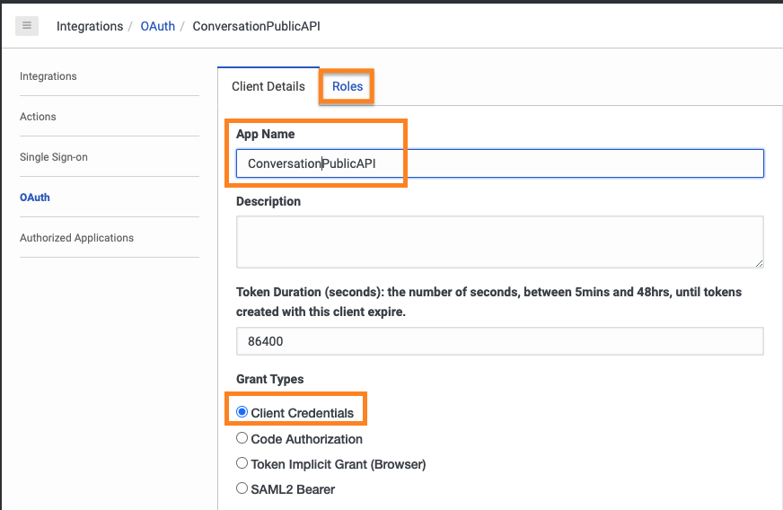

6. Click **Save**. Copy the client ID and the client secret values for later use.

  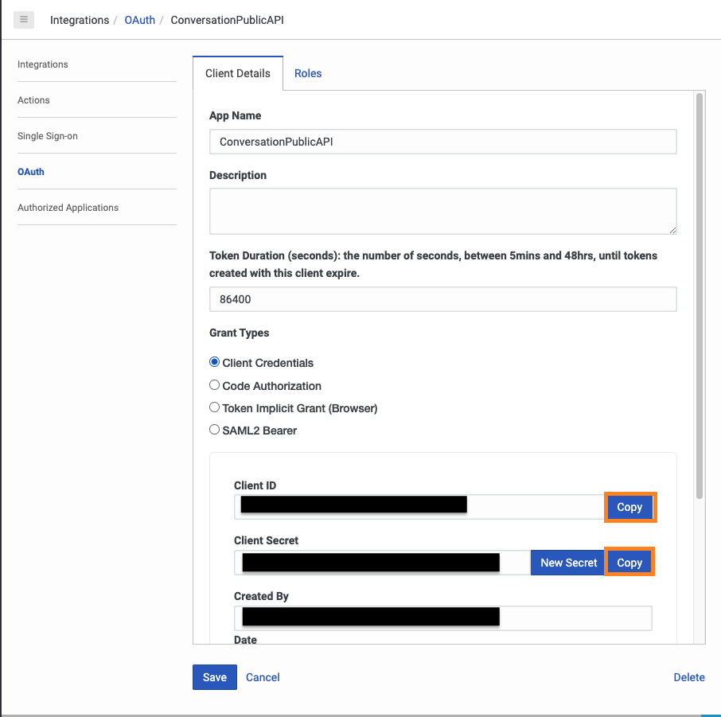

### Add two Genesys Cloud data action integrations

To get a user's presence in Genesys Cloud, you call a Genesys Cloud public API. To enable this public API call, add a Genesys Cloud data actions integration.

1. Navigate to **Admin** > **Integrations** > **Integrations** and install the **Genesys Cloud Data Actions** integration. For more information, see [About the data actions integrations](https://help.mypurecloud.com/?p=209478 "Opens the About the data actions integrations article") in the Genesys Cloud Resource Center.

   

2. Enter a name for the Genesys Cloud data action.

   

3. On the **Configuration** tab, click **Credentials** and then click **Configure**.

   

4. Enter the client ID and client secret of the presence OAuth client that you in the previous step (#create-an-oauth-client-for-use-with-the-genesys-cloud-data-action-integration "Goes to the create an OAuth Client section"). Click **OK** and save the data action.

   

5. Navigate to the main Integrations page and set the presence data action integration to **Active**.

   

 To update the external tag of a conversation in Genesys Cloud, you call a Genesys Cloud public API. To enable this public API call, add a Genesys Cloud data actions integration.

6. Navigate to **Admin** > **Integrations** > **Integrations** and install the **Genesys Cloud Data Actions** integration. For more information, see [About the data actions integrations](https://help.mypurecloud.com/?p=209478 "Opens the About the data actions integrations article") in the Genesys Cloud Resource Center.

  

7. Enter a name for the Genesys Cloud data action.

  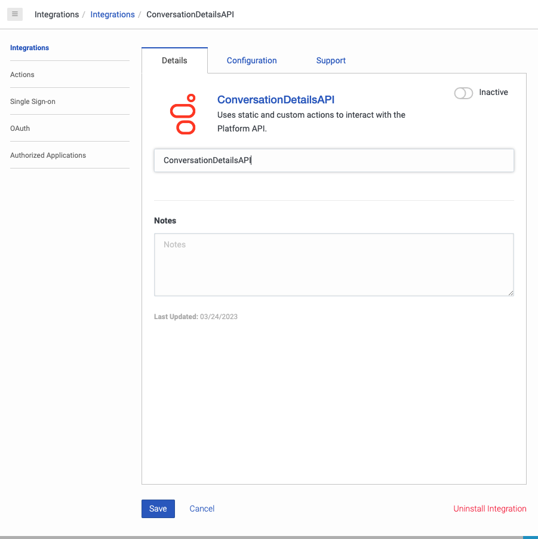

8. On the **Configuration** tab, click **Credentials** and then click **Configure**.

  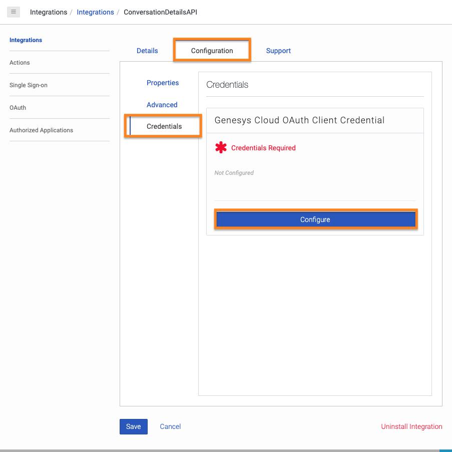

9. Enter the client ID and client secret of the conversation OAuth client that you in the previous step (#create-an-oauth-client-for-use-with-the-genesys-cloud-data-action-integration "Goes to the create an OAuth Client section"). Click **OK** and save the data action.

  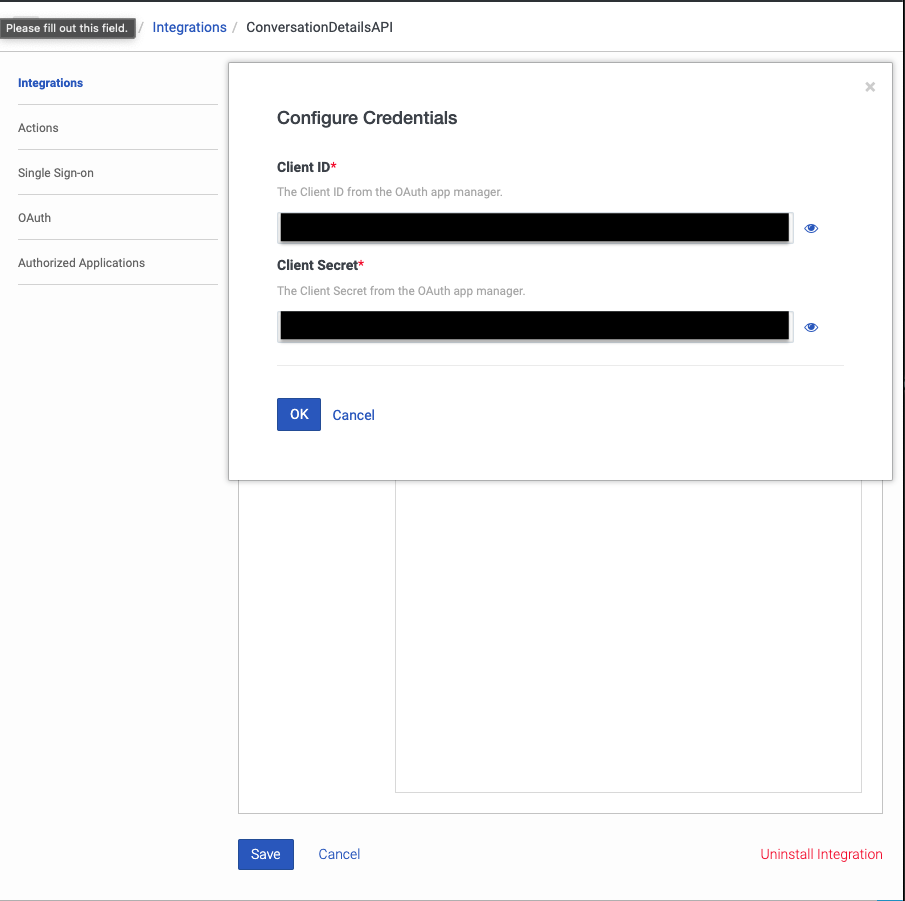

10. Navigate to the main Integrations page and set the presence data action integration to **Active**.

  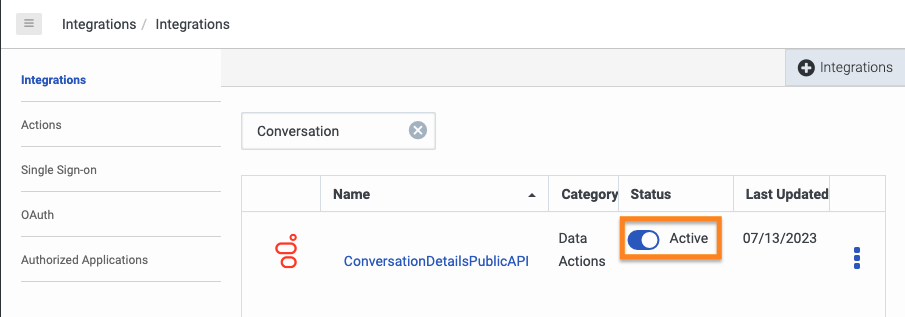

### Import three Genesys Cloud data actions

The GC User Presence data actions use the authenticated token that is supplied by the presence GC OAuth Client created in the previous step.

1. From the [update-external-tag-on-communicate-call-blueprint repo](https://github.com/GenesysCloudBlueprints/terminate-voice-calls-with-no-queue/tree/update-external-tag) GitHub repository, download the GetGenesysCloudUserPresenceDefinition.custom.json file.

2. In Genesys Cloud, navigate to **Integrations** > **Actions** and click **Import**.

   

3. Select the GetGenesysCloudUserPresenceDefinition.custom.json file and associate it with the **Get Genesys Cloud User Presence** integration that you created in the [Add a web services data actions integration](#add-a-web-services-data-actions-integration "Goes to the Add a web services data actions integration section") section, and then click **Import Action**.

   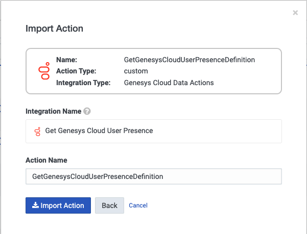

4. From the [update-external-tag-on-communicate-call-blueprint repo](https://github.com/GenesysCloudBlueprints/terminate-voice-calls-with-no-queue/tree/update-external-tag) GitHub repository, download the GetGenesysCloudPresenceDefinitionLabel.custom.json file.

5. In Genesys Cloud, navigate to **Integrations** > **Actions** and click **Import**.

  

6. Select the GetGenesysCloudPresenceDefinitionLabel.custom.json file and associate it with the **Get Genesys Cloud User Presence** integration that you created in the [Add a web services data actions integration](#add-a-web-services-data-actions-integration "Goes to the Add a web services data actions integration section") section, and then click **Import Action**.

  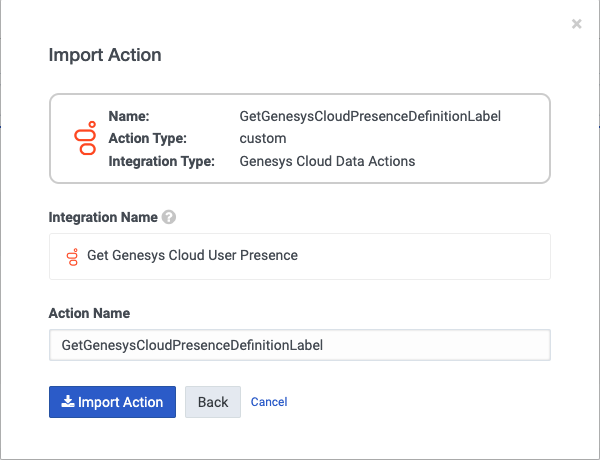

The GC conversation update data action use the authenticated token that is supplied by the conversation GC OAuth Client created in the previous step.

7. From the [update-external-tag-on-communicate-call-blueprint repo](https://github.com/GenesysCloudBlueprints/terminate-voice-calls-with-no-queue/tree/update-external-tag) GitHub repository, download the PutConversationTag.custom.json file.

8. In Genesys Cloud, navigate to **Integrations** > **Actions** and click **Import**.

   

9. Select the PutConversationTag.custom.json file and associate it with the **ConversationDetailsAPI** integration that you created in the [Add a web services data actions integration](#add-a-web-services-data-actions-integration "Goes to the Add a web services data actions integration section") section, and then click **Import Action**.

   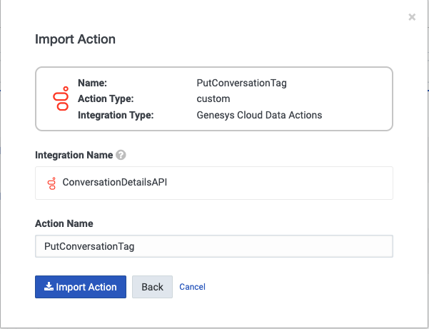

### Import the Architect workflow

This solution includes an Architect workflow that use the data actions you just created. This workflow retrieves the GC user's presence and updates the conversation's external tag with their primary and secondary presence values.

* The **UpdateExternalTagOnConversation.i3WorkFlow** workflow is triggered when a GC user receives a Communicate call.

Import this workflow to your Genesys Cloud organization.

1. Download the **UpdateExternalTagOnConversation.i3WorkFlow** file from the [update-external-tag-on-communicate-call-blueprint repo](https://github.com/GenesysCloudBlueprints/terminate-voice-calls-with-no-queue/tree/update-external-tag) GitHub repository.

2. In Genesys Cloud, navigate to **Admin** > **Architect** > **Flows:Workflow** and click **Add**.

   

3. Name your workflow and click **Create**.

  

4. From the **Save** menu, click **Import**.

   

5. Select the downloaded **Set GC User to Busy.i3WorkFlow** file. Click **Import**.

   

6. Review your workflow. Copy the workflow ID from the URL and save it. You will need it to create the event orchestration trigger. After you have reviewed your workflow, click **Save** and then click **Publish**.

  

### Create an OAuth client for use for Event Orchestration trigger creation

To create the Event Orchestration triggers, use an OAuth client to configure authentication with the Genesys Cloud Public API.

1. Navigate to **Admin** > **Integrations** > **OAuth** and click **Add Client**.

   

2. Enter a name for the OAuth client and select **Client Credentials** as the grant type. Click the **Roles** tab and assign the triggers role you created earlier in this blueprint for this OAuth client.

     

3. Click **Save**. Copy the client ID and the client secret values for later use.

   

## Create the event orchestration triggers

After you have created the workflows, create the triggers that call them. You need event orchestration activated in your Genesys Cloud organization and you need Postman running on your machine.

1. From the [update-external-tag-on-communicate-call-blueprint](https://github.com/GenesysCloudBlueprints/terminate-voice-calls-with-no-queue/tree/update-external-tag) GitHub repository, download the Genesys Cloud Event Orchestration Trigger API's.postman_collection.json file.

2. In Postman, click **Import**

   

3. Select the Genesys Cloud Event Orchestration Trigger API's.postman_collection.json file and click **Import**

   

4. In the Genesys Cloud Event Orchestration API's folder, select **Genesys Cloud Client Credential Token Creation**. Change your API domain to match the AWS region in which your Genesys Cloud organization is hosted. The Genesys Cloud organization in this screenshot is hosted in us-east-1.

5. Click the **Authorization** tab. In the **Username** field, paste the client ID from the [OAuth client that you created](#create-an-oauth-client-for-use-with-the-genesys-cloud-data-action-integration "Goes to the Create an OAuth client for use with the Genesys Cloud data action integration section"). In the **Password** field, paste the client secret from the same OAuth client. Click **Send**.

  

6. From the body of the response, copy the **access token**.

     

7. Click **ProcessAutomation Trigger Creation**. On the **Authentication** tab, select **Bearer Token** and paste the access token from the previous step.

     

8. Click the **Body** tab. Be sure to change your API domain to match the AWS region your Genesys Cloud organization is hosted. Replace **my-workflow-id** with the id of the **UpdateExternalTagOnConversation** Architect workflow that you created earlier in this blueprint. Click **Send**.

     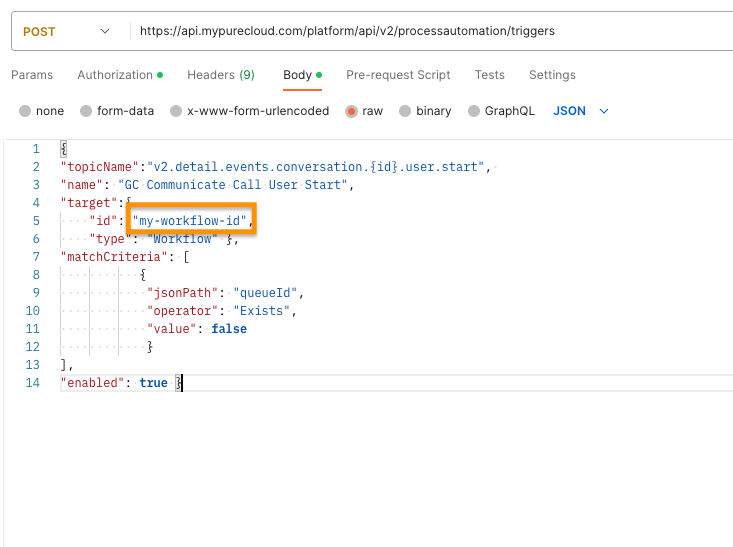

     **Note:** If you'd like your JSON Body to match the screenshot, copy at paste the following JSON string.
     :::

     {
       "topicName":"v2.detail.events.conversation.{id}.user.start",
       "name": "GC Communicate Call User Start",
       "target":{
         "id": "my-workflow-id",
         "type": "Workflow" },
         "matchCriteria": [
            {
             "jsonPath": "queueId",
             "operator": "Exists",
             "value": false
             }
             ],
         "enabled": true
     }

## Additional resources

* [Genesys Cloud API Explorer](https://developer.genesys.cloud/devapps/api-explorer "Opens the GC API Explorer")
* [Genesys Cloud notification triggers ("Available topics")](https://developer.genesys.cloud/notificationsalerts/notifications/available-topics "Opens the Available topics page")
* [Prefixes for AWS regions](https://developer.genesys.cloud/platform/api/ "Open the Overview page in the API section of the Genesys Cloud Developer Center")
* [Postman API Platform](https://www.postman.com/ "Goes to the Postman API Platform page") in the Postman documentation
